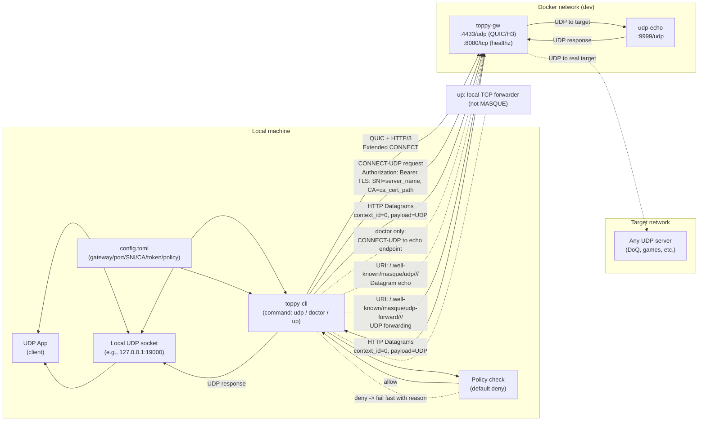
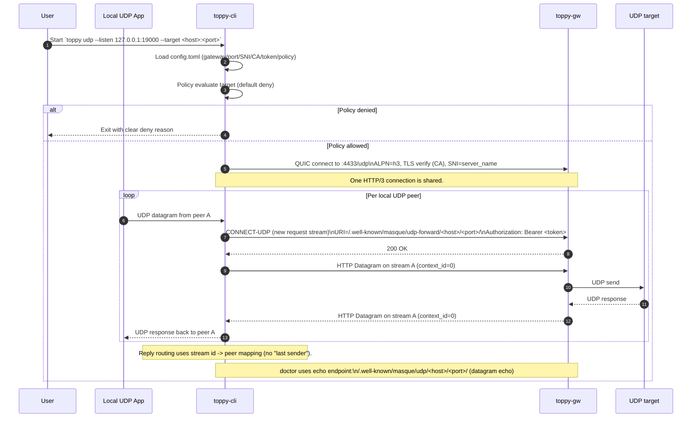

# toppy

Toppy is a Rust workspace for experimenting with a MASQUE-capable gateway and a small client CLI.

Today, it focuses on:
- A minimal gateway (`toppy-gw`) that supports QUIC ping and HTTP/3 Extended CONNECT for CONNECT-UDP (doctor echo + UDP forwarding).
- A CLI (`toppy-cli`) with environment diagnostics (`doctor`), token acquisition (`login`), and policy-guarded local forwarders (`up` for TCP, `udp` for UDP).

## Project structure

The project is organized as a Cargo workspace with multiple crates:

- `toppy-cli`: Command-line interface for users to interact with the gateway and manage connections.
- `toppy-gw`: A lightweight QUIC + HTTP/3 gateway (QUIC ping + CONNECT-UDP echo/forward).
- `toppy-core`: Shared functionality, including configuration management, policy enforcement, and logging.
- `toppy-proto`: Definitions of the custom capsule/command messages used between client and gateway.
- `education`: Educational materials and quizzes (deployed to [GitHub Pages](https://thinksyncs.github.io/toppy/)).

See `spec.md` for a usage-oriented spec, and `TODO.md` / `bd` for backlog tracking.

## Quickstart (5 min)

1. Install Rust stable (rustup).
2. Build the workspace:
   - `cargo build`
3. Create a minimal config:
   - `~/.config/toppy/config.toml`
   - Example:
     ```toml
     gateway = "127.0.0.1"
     port = 4433
     server_name = "localhost"
     ca_cert_path = "crates/toppy-gw/testdata/localhost-cert.pem"
     auth_token = "dev-token"
     mtu = 1350

     [policy]
       [[policy.allow]]
       cidr = "127.0.0.1/32"
       ports = [22, 443]
     ```

   - JWT auth (optional):
     - Set `TOPPY_GW_JWT_SECRET` (and optional `TOPPY_GW_JWT_ISS`, `TOPPY_GW_JWT_AUD`) in the gateway.
     - Set `auth_token` to a JWT signed with the shared secret.

   - Auth mode selection:
     - Default behavior stays the same: `auth_token` is used as-is.
     - You can also specify an explicit mode under `[auth]`:
       ```toml
       [auth]
       mode = "token"
       token = "dev-token"
       ```
     - OIDC device-code login:
       ```toml
       [auth]
       mode = "oidc_device_code"
       issuer = "https://issuer.example"
       client_id = "toppy-cli"
       audience = "toppy"              # optional
       scope = "openid offline_access" # optional (defaults to openid/offline_access)
       token_cache_path = "/path/to/oidc-token.json" # optional
       ```
       - Run `toppy login` to complete the device-code flow and cache a token.
       - `toppy doctor` uses the cached token and refreshes it if possible.
     - SAML via broker/federation:
       ```toml
       [auth]
       mode = "saml"
       idp_entity_id = "https://idp.example/saml"
       sp_entity_id = "toppy-sp"               # optional
       broker_issuer = "https://broker.example"
       broker_client_id = "toppy-cli"
       broker_audience = "toppy"               # optional
       broker_scope = "openid offline_access"  # optional
       token_cache_path = "/path/to/saml-token.json" # optional
       ```
       - `toppy login` runs OIDC device-code against the broker.
4. Run the doctor checks:
   - `cargo run -p toppy-cli -- doctor --json`
   - Or `make doctor`

## What the CLI does

- `toppy doctor` loads config and runs checks like DNS resolution, QUIC ping (with TLS verification + token validation), CONNECT-UDP handshake, CONNECT-UDP datagram echo, TUN permission probe, MTU sanity, and optional policy evaluation.
- `toppy login` performs token acquisition for OIDC device-code mode (and SAML-via-broker mode) and caches a token locally.
- `toppy up` is a local TCP forwarder guarded by the configured policy (it is not a MASQUE tunnel yet). It also applies a per-connection token-bucket rate limit.
- `toppy udp` is a local UDP proxy guarded by the configured policy. It forwards UDP payloads over CONNECT-UDP (HTTP/3 Extended CONNECT + HTTP Datagrams).
- `toppy audit verify` verifies the local tamper-evident JSONL audit log hash chain.

## Mermaid diagrams

### Components + dataflow



### UDP proxy sequence (multi-client)



## Dev setup

If you don't have Rust installed yet, run:

- `make bootstrap`

Manual install (recommended):

- macOS/Linux: `curl --proto '=https' --tlsv1.2 -sSf https://sh.rustup.rs | sh` then `source ~/.cargo/env`
- Windows: install from https://rustup.rs/

After that, local quality gates:

- `make fmt clippy test`

## Config path override

- Default config path: `~/.config/toppy/config.toml`
- Override: set `TOPPY_CONFIG=/path/to/config.toml`

## Windows Wintun (TUN)

Toppy uses the Wintun driver to create TUN interfaces on Windows. The DLL is
loaded at runtime (sidecar or system install), not embedded.

Lookup order for `wintun.dll`:

1. `TOPPY_WINTUN_DLL` (full path)
2. `TOPPY_WINTUN_DIR` (directory containing `wintun.dll`)
3. `wintun.dll` alongside the executable
4. Current working directory

`toppy doctor` attempts to open an adapter named `toppy-doctor`. If it does not
exist, it creates and deletes the adapter to validate permissions. Override the
adapter name with `TOPPY_WINTUN_ADAPTER`.

### Integration test strategy (Windows TUN)

- Manual smoke test (Windows host/runner):
  1. Place `wintun.dll` and set `TOPPY_WINTUN_DLL` (or `TOPPY_WINTUN_DIR`).
  2. Run `toppy doctor --json` and verify `tun.perm` is `pass`.
  3. Confirm no lingering `toppy-doctor` adapter remains.
- CI: `windows-wintun-doctor` downloads `wintun.dll`, sets the env var,
  runs `toppy doctor --json`, and asserts `tun.perm` is `pass`.

### CONNECT-UDP verification (doctor)

If the gateway is running and reachable, `toppy doctor` will also attempt a minimal
CONNECT-UDP validation using HTTP/3 Extended CONNECT + HTTP Datagrams.

- Start the gateway (one option):
   - `make compose-up`
- Run doctor:
   - `make doctor`

In the JSON output, verify these checks are `pass`:

- `masque.connect_udp` (Extended CONNECT handshake)
- `masque.connect_udp.datagram` (HTTP Datagram echo)

## Gateway healthcheck (docker compose)

- `make compose-up`
- Wait until `docker compose ps` shows `healthy` for `toppy-gw`.
- `curl -fsS http://localhost:8080/healthz`
- `make compose-down`

## Threat model (summary)

- Short-lived credentials and default-deny policies to limit blast radius.
- Audit logs for connection activity are recorded locally as tamper-evident JSONL.
- Out of scope for MVP: full L3 VPN, direct SAML integration, advanced UDP proxy features (multi-peer mapping, NAT behaviors, QoS).

## Audit logs

Toppy can write a tamper-evident audit log (hash-chained JSONL) for actions like `doctor` and `up`.

Audit log path resolution (highest priority first):

1. `TOPPY_AUDIT_LOG` env var
2. `audit_log_path` in `config.toml`
3. Default: `~/.local/share/toppy/audit.jsonl`

Verify the log:

- `cargo run -p toppy-cli -- audit verify`
- Or: `TOPPY_AUDIT_LOG=/path/to/audit.jsonl cargo run -p toppy-cli -- audit verify`

## IdP expansion (Phase 3 decision)

For the next milestone, Toppy treats MFA and FIDO2 as **IdP concerns**, not separate client modes:

- Supported now: **static token/JWT** via `auth_token` (or `[auth] mode="token"`).
- Supported now: **OIDC device-code flow** (MFA/FIDO2 happen at the IdP during login).
- Supported via broker: **SAML** (recommended: SAML-to-OIDC broker / federation, or mint JWT out-of-band).

## Session rate limiting (`toppy up`)

The `toppy up` TCP forwarder applies a per-connection token-bucket rate limit to session traffic.

Defaults (when `[rate]` is omitted): **10 MiB/s** with a **10 MiB burst** (per direction).

Configure in `~/.config/toppy/config.toml`:

```toml
[rate]
bytes_per_sec = 10485760
burst_bytes = 10485760
```

Disable:

```toml
[rate]
bytes_per_sec = 0
burst_bytes = 0
```

## License

MIT
